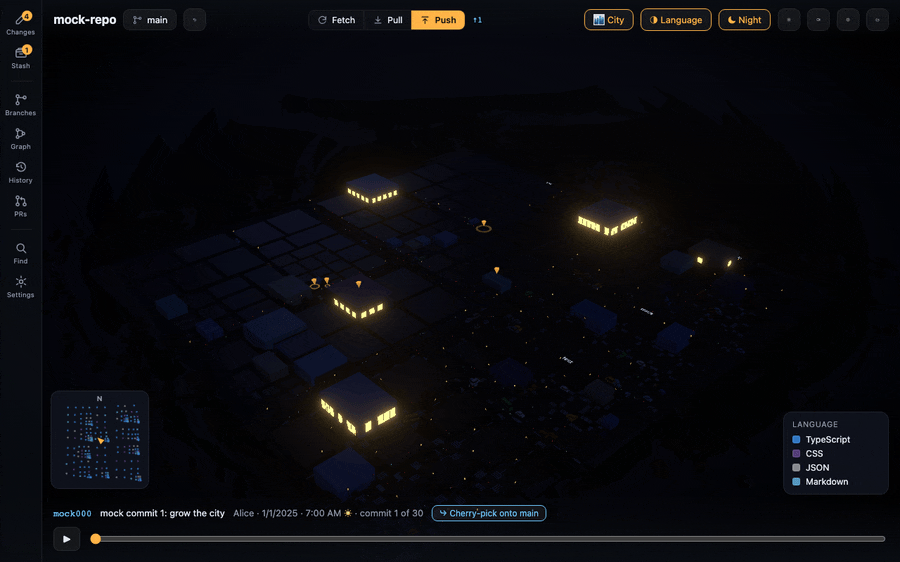
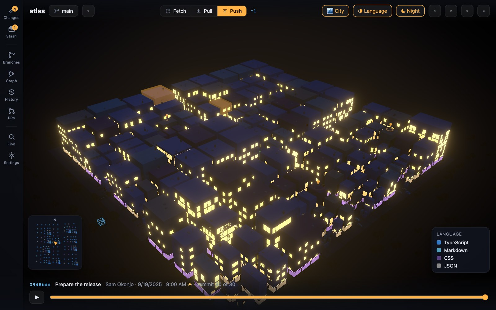
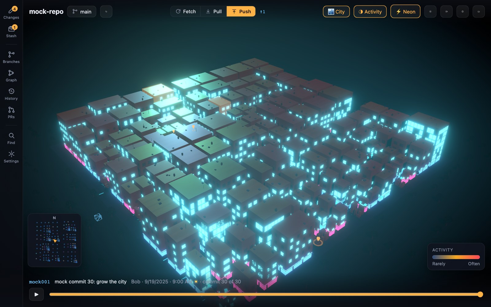
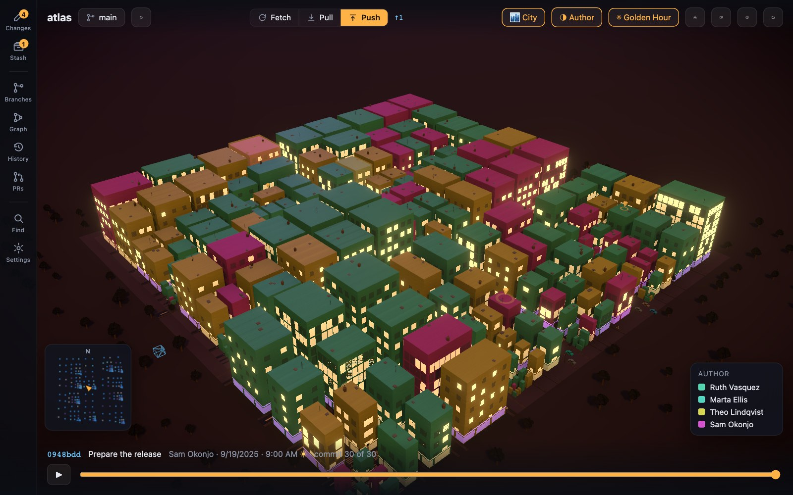
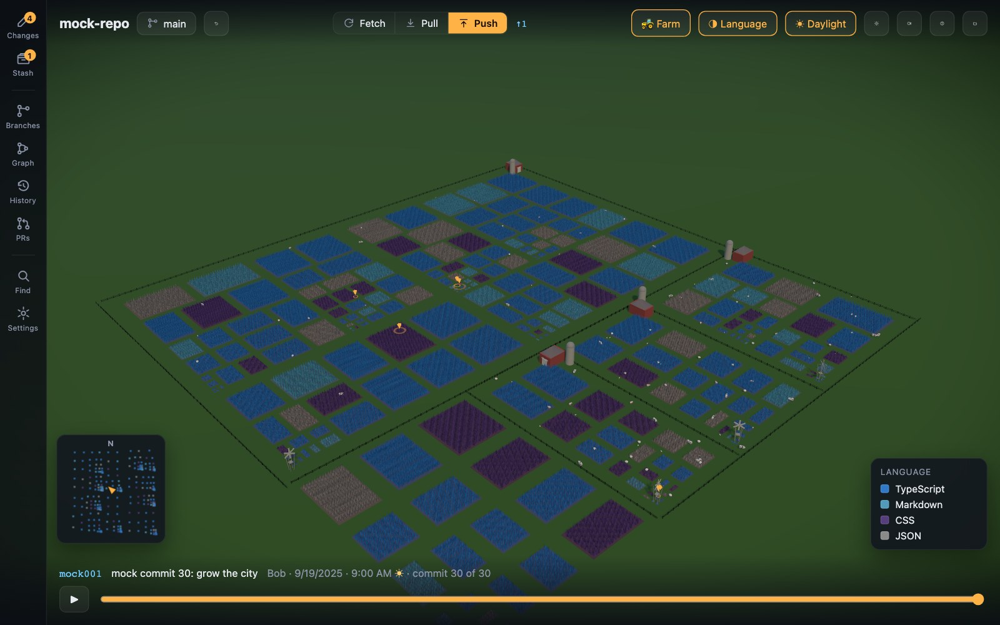

# Git City

[](https://github.com/maximalcode/git-city/actions/workflows/ci.yml)
[](https://github.com/maximalcode/git-city/releases/latest)
[](LICENSE)

Watch your git repository come alive as a 3D city — and work in it. Folders
become districts, files become buildings (height = lines of code), a timeline
scrubs through history while the city grows, and a full git client lives on
top: stage, commit, fetch, pull, push, branch, merge, rebase, stash,
cherry-pick and tag without leaving the city.



Prefer something calmer? Press `V` and the same repository becomes a **farm**:
files are fields of crop that rise and fall with the line count, folders are
fenced parcels with their own barn and silo, and livestock work their way across
the holding.

## Download

Grab the latest build from **[Releases](https://github.com/maximalcode/git-city/releases/latest)**
— a Windows installer, DMGs for both Apple Silicon and Intel Macs, and an
AppImage + `.deb` for Linux (the AppImage just needs `chmod +x`, no install).

Git City shells out to `git`, so you need **git on your PATH**. It never asks
for a token and stores nothing: pull requests go through the `gh` / `glab` CLI,
signing stays with gpg-agent / ssh-agent, and there is no telemetry.

> **The installers are unsigned.** Windows SmartScreen shows "unknown
> publisher" — choose _More info → Run anyway_. macOS is blunter and calls the
> app _"damaged"_: right-click the app → **Open**, or run
> `xattr -d com.apple.quarantine "/Applications/Git City.app"`. Signing is on
> the roadmap; it needs a paid certificate. Linux has no equivalent gate — the
> AppImage and deb run as-is.

Anything else that goes wrong on first run is in
**[Troubleshooting](docs/troubleshooting.md)**.

## What it looks like

|                                                                     |                                                         |
| ------------------------------------------------------------------- | ------------------------------------------------------- |
|            |  |
| **Realistic Night**, coloured by language                           | **Neon**, coloured by how often files change            |
|       |                                                         |
| **Golden Hour**, coloured by who touched each file last             |                                                         |
|                                    |                                                         |
| **Farm view** — fields of crop, fenced parcels, barns and livestock |                                                         |

## Features

- **Two ways to see a repo** — the 3D **City** and the **Farm** (`V` switches)
- **Scrub the whole history** — a full replay fits in ~10 seconds, and the sky
  tracks each commit's local hour as you go
- **6 colour encodings** — language, activity, author, recency, size, file type,
  each with a legend
- **A real git client on top** — stage by file, hunk or individual line, commit,
  sync, branch, merge, rebase, stash, cherry-pick, tag, and an interactive
  rebase editor
- **Time machine** — one-click undo of the last HEAD move, and a reflog panel to
  rewind to any past position or recover a lost commit
- **Pull requests without leaving** — GitHub via `gh`, GitLab via `glab`, with CI
  status; light up a PR's changed files across the city to see its blast radius
- **Command palette** (`Ctrl`/`Cmd`+`K`) — every action, plus `@` to search
  commits and `:` to grep code
- **Time-lapse export** — record the whole history growing as a WebM

<details>
<summary><b>The complete feature list</b></summary>

**Visualization**

- **Two view modes** (`V` switches, persisted): the 3D **City** and the **Farm**
- City: districts per folder, buildings per file with **photo-real facades**
  (per-building window grids in three styles, ground-floor shopfronts, rooftop
  clutter — AC units, water tanks, antennas — and a contact-shadow base); real
  streets surfaced with **bundled CC0 PBR textures** (asphalt, paving-stone
  sidewalks), zebra crossings, stop lines, manholes, parked cars at the curb and
  traffic lights at big junctions; commit-weighted traffic in four body styles
  (sedan / wagon / van / bus, plus bikes — hover-craft in Neon) with head/tail
  lights; lamp posts and street trees along the roads
- Farm: every file is a cultivated field whose crop rises and falls with the
  live line count, and whose **crop class follows the file's size** — leafy rows
  for small files, standing cereal for mid-size, orchards of fruit trees for the
  largest. Folders are fenced parcels, each with a barn and silo (wind pumps on
  the big ones), worked by grazing herds of cattle, sheep, pigs and chickens
- Timeline playback: scrub or play the entire history (a full replay fits in
  ~10 seconds)
- 5 themes (Realistic Day/Night, Neon, Golden Hour, Midnight Ink) with
  procedural lit windows, sky gradients and ambient occlusion
- 6 color modes — language, activity, author, recency, size, file type — each
  with an always-visible legend explaining the encoding, identical in both
  view modes
- Camera fly-to on selection, cinematic intro orbit
- **Command palette** (`Ctrl`/`Cmd`+`K`): fuzzy-search every action and jump to
  any file (camera flies there), switch branch, pop a stash, change view / theme
  / colour — all from one box. Two search modes by leading sigil: **`@`** searches
  **commits** (message / author / hash, across all refs) and **`:`** searches
  **code** in tracked files (`git grep`). A commit hit opens a detail panel
  (signature state, changed files → diff, cherry-pick, fly-to) that works for
  _any_ commit, not just the sampled ones
- **Orientation minimap** with a compass marker tracking the camera, so big
  repos never lose you (north up)
- **Time-of-day** control decoupled from the theme — drag the sun from night
  through noon to dusk; the key light and shadows move with it. Or leave
  **"sky follows commit time"** on (default): the sun tracks each commit's local
  hour, so scrubbing history walks the city from a morning commit's light into a
  late-night commit's dark — the commit clock shows in the playback ticker
- **Activity hotspots**: the files churning most this week pulse with a glowing
  beacon over their rooftop / canopy
- **First-run guide** explaining the height / colour / shape encoding, re-openable
  any time from the `?` button
- Hover any file for a cursor-following tooltip (language, size, commits, last
  author + date); **double-click** it to jump straight into its diff
- A **now-playing** commit banner during history playback (message, author, date)

**Git client**

- Working-tree status overlaid on the city; stage/unstage/discard, commit
  (+ amend). Expand any changed file to **stage, unstage or discard
  individual hunks** (`git add -p`, but visual) — or click individual changed
  lines to **stage / unstage / discard just those lines**
- Per-file diff also renders **image diffs** (png/jpg/gif/webp/svg…): the old
  and new picture side by side with a byte-size delta
- Fetch / pull / push with progress and cancel — **force-push does not exist
  in this app, by design**
- Branches (incl. remote-tracking), merge, rebase, cherry-pick, stashes, tags
- **Submodules** (status + one-click update) and **worktrees** (list, open,
  remove) surfaced in the Branches panel
- **Commit signing**: a "Sign" toggle in the commit box (defaults to the repo's
  `commit.gpgsign`), and a verified/unverified badge on commits — keys stay with
  gpg-agent / ssh-agent, never handled by the app
- Interactive rebase editor (reorder / squash / drop) — local history only
- In-app merge-conflict resolver (ours / theirs / both / edit per hunk)
- **Time machine (reflog):** one-click Undo of the last HEAD move (keeps your
  uncommitted work and is itself undoable), plus a panel of every past HEAD
  position — rewind the branch to any of them, or recover a "lost" commit as a
  new branch. Local refs only; never force-pushes.
- Per-file diff viewer — **unified or side-by-side** (toggle, persisted) with
  **word-level intra-line highlighting** — plus file history (follows renames)
  and blame
- Commit graph with branch topology, ref chips, checkout/cherry-pick actions
- **Pull requests** (GitHub via the `gh` CLI, GitLab via `glab` — no token setup
  either way): list open PRs/MRs with rolled-up CI status, see the current
  branch's, check one out, open it in the browser, or create one for the current
  branch. GitLab merge requests use the same model — only the wording follows
  the host. Falls back to a clear hint when the CLI is missing or logged out
- **Review a PR in the city**: pick any PR and its changed files light up with
  blue beacons across the city/farm — see a pull request's blast radius at a
  glance, then step the camera through each touched file. A banner names the PR
  and counts the files; Escape (or Exit) ends the review
- **Fresh repos welcome**: open a repository with no commits yet (a brand-new
  `git init`) and make the first commit from inside Git City — the city grows
  the moment you do. Detached HEAD is labelled clearly and a missing `git`
  install is explained on the welcome screen
- Recent repos, drag-drop a folder to open, file search with fly-to
- **Settings** panel (`,`) gathering every preference in one place — theme,
  view, time of day, sky-follows-commit, a **reduce-motion** toggle (skips the
  intro orbit and stills the wind), activity hotspots, the default diff layout,
  plus re-show the first-run guide, clear recent repositories and reset all
  preferences
- **Update check**: on launch Git City asks GitHub Releases whether a newer
  version exists and, if so, shows an unobtrusive banner linking to the
  download. No token, no background download, no telemetry — you stay in
  control of installing (there is also a manual check in Settings)
- **Time-lapse export**: the record button (top bar) replays the whole history
  while capturing the canvas to a **WebM video** you can share — your repo
  growing from first commit to now, in ~10 seconds. Uses the browser's own
  MediaRecorder, so no new dependency

</details>

**Keyboard shortcuts**

| Key              | Action                         |
| ---------------- | ------------------------------ |
| `Ctrl`/`Cmd`+`K` | Command palette                |
| `C`              | Changes panel                  |
| `B`              | Branches panel                 |
| `S`              | Stashes panel                  |
| `G`              | Commit graph                   |
| `U`              | Time machine (reflog undo)     |
| `P`              | Pull requests                  |
| `V`              | Toggle City / Farm view        |
| `/`              | Find a file (arrows + Enter)   |
| `,`              | Settings                       |
| `Space`          | Play/pause the timeline        |
| `Escape`         | Close panels / clear selection |

Also as a page: [docs/shortcuts.md](docs/shortcuts.md).

## How it works

Git City runs one streaming pass of
`git log --first-parent --reverse --no-renames --raw --numstat` over the repo.
Along first-parent history the diffs telescope, so cumulatively applying each
commit's added/deleted line counts reproduces the exact line count of every
file at every mainline commit — no checkouts, no per-file git calls. ~50 evenly
spaced snapshots feed the timeline; the treemap city layout is computed once
over every file that ever existed, so buildings rise, shrink and vanish but
never move while you scrub.

Git operations run in the Electron main process through a per-repo lock (two
of our own commands never race for `index.lock`), with a file watcher that
keeps the UI live and mutes itself during operations.

### How big a repo can it take?

Most projects open instantly. The honest limits, measured rather than guessed:

| Repo size          | What to expect                                                                                                                              |
| ------------------ | ------------------------------------------------------------------------------------------------------------------------------------------- |
| up to ~5,000 files | opens in seconds, city reads clearly                                                                                                        |
| ~20,000 files      | still fine; this is also the ceiling on how many buildings get drawn                                                                        |
| above 20,000 files | the **20,000 largest files** are drawn and the top bar says so — e.g. `20,000 of 81,368 files`. Reading the history still costs full price. |

Git City checks the size before opening and tells you what you are in for, so
you can back out rather than watch a progress bar and wonder.

The draw ceiling exists because past it the scene stops being worth building: a
`microsoft/TypeScript` clone (81,368 files) took **212 seconds** to become
interactive with every file drawn, against ~25 with the cap — and above ~60,000
files the streets have already stopped being drawn anyway, because the plots are
too small to fit a road between them. The history pass is separate and scales
with commit count: 14,271 first-parent commits takes about 130 seconds.

Collapsing deep directories, so a monorepo is genuinely _readable_ rather than
merely fast, is still open — the cap keeps the app usable, it does not make a
80,000-file repository legible.

## Development

```bash
npm install
npm run dev        # launch the Electron app with hot reload
npm test           # vitest: git backend, parsers, layout, themes (~380 tests)
npm run typecheck
npm run lint       # ESLint (typescript-eslint + react-hooks)
npm run format     # Prettier
```

`npm run dev` requires git on your PATH (the app shells out to it).

There is also a browser-only preview of the renderer for quick visual work
(no Electron, no git). Open `http://localhost:5199/?mock` for a deterministic
synthetic repo (250 files, 30 snapshots) with fake working-tree status — both
view modes fully explorable:

```bash
npx vite -c vite.preview.config.ts
```

Add a count to scale the synthetic repo — `?mock=20000` — which is how the
scene gets measured against monorepo-sized input without cloning one.

The README media is captured from that preview, so it is reproducible rather
than hand-cropped (needs [gifski](https://gif.ski) for the hero animation):

```bash
node scripts/capture-media.mjs
```

## Packaging

```bash
npm run dist:win   # NSIS installer → dist/ (build on Windows)
npm run dist:mac   # arm64 + x64 DMGs → dist/ (must be built on a Mac)
```

The app icon is generated procedurally: `node scripts/make-icon.js`.

Installers are unsigned, so Windows SmartScreen / macOS Gatekeeper will warn
on first launch. For real distribution add code signing (a Windows code
signing cert / Apple Developer ID + notarization).

## Architecture

- `src/main/` — Electron main process: window, IPC, git analysis and the git
  op backend. `git/analyze.ts` is the history replay engine; `git/` holds one
  module per concern (status, stage, commit, sync, branches, merge, conflicts,
  stash, tags, diff, history, graph, interactive rebase) — raw `spawn`
  everywhere except fetch/pull/push, which use simple-git for progress +
  abort. Errors surface as a uniform `OpResult`; read-only IPC channels never
  leak raw git stderr to the renderer.
- `src/preload/` — typed `window.gitCity` bridge.
- `src/renderer/` — React + react-three-fiber UI. `layout/` holds the pure,
  unit-tested scene math: the squarified treemap, the street graph derived
  from it, and the farm layout. `city/` renders both scenes (instanced
  buildings, district plates, streets with sidewalks, traffic, street furniture,
  trees, effects) behind a mode-agnostic `SceneView` shell; `panels/` holds the
  git client UI; `store.ts` (zustand) is the single state funnel.
- `src/shared/types.ts` — types shared across all three.

Note: the app intentionally avoids `@react-three/drei` — we only needed
MapControls (see `city/CameraRig.tsx`), and drei's text stack embeds a
base64 WASM blob that antivirus heuristics love to false-positive on. All
vehicle and tree geometry is likewise built in-code from merged three.js
primitives, no external models.

## Docs

- [Troubleshooting](docs/troubleshooting.md) — unsigned installers, git not on
  `PATH`, slow repositories, empty cities
- [What the colours mean](docs/colour-modes.md) — the six encodings
- [Keyboard shortcuts](docs/shortcuts.md)
- [Security](SECURITY.md) — what leaves your machine (one version check), what
  it executes, how to report a vulnerability
- [Releasing](RELEASING.md) — cutting a release

## Contributing

Development happens through GitHub issues — see [CONTRIBUTING.md](CONTRIBUTING.md)
for the setup and the branch/PR flow. Bug reports and feature requests are
welcome; there are issue templates for both.

## License

[MIT](LICENSE) © maximalcode

Bundled textures are CC0 from [ambientCG](https://ambientcg.com) — see
[ATTRIBUTION.md](src/renderer/src/assets/textures/ATTRIBUTION.md).
