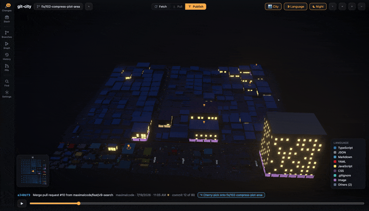
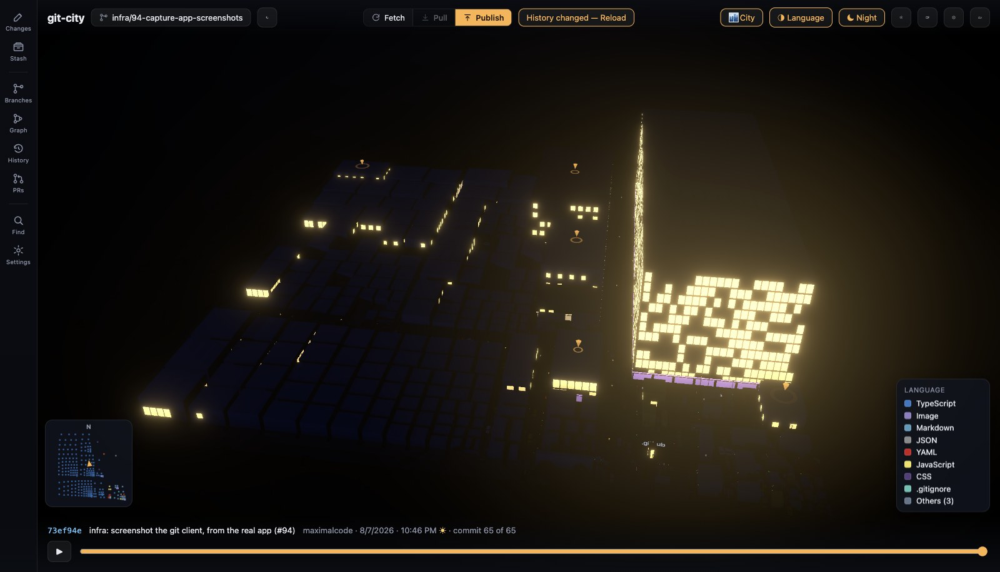
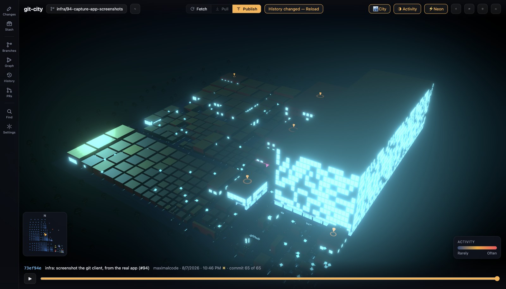
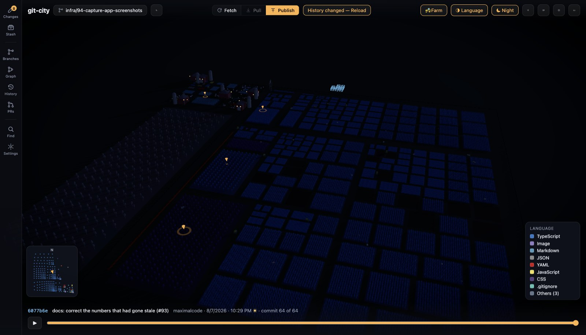
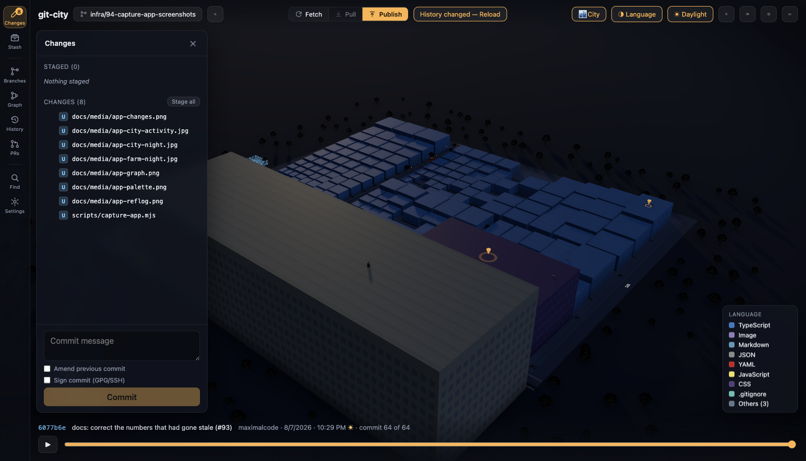
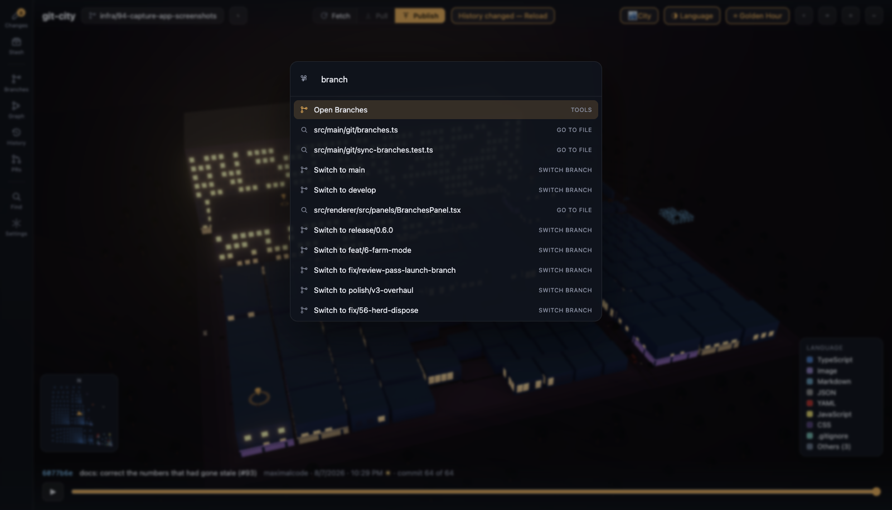
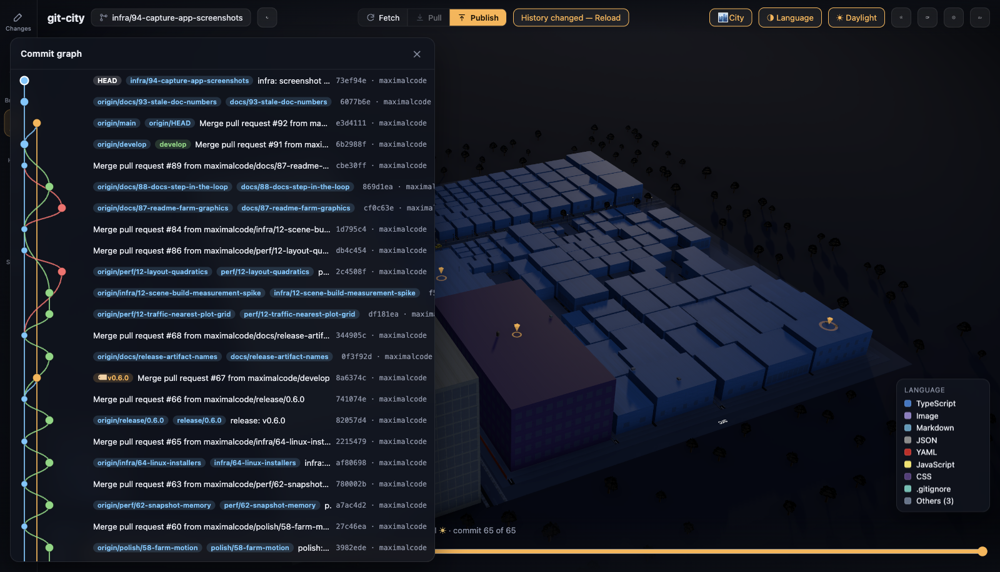
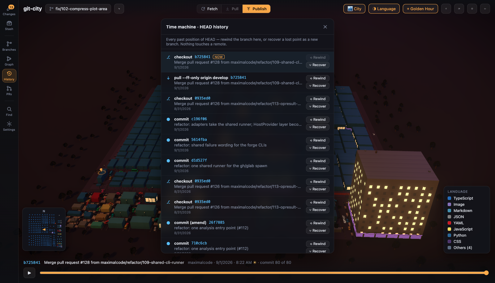

# Git City

**See your repository. Then work in it.**

### [⬇ Download for macOS, Windows or Linux](https://github.com/maximalcode/git-city/releases/latest)

---

## What you are looking at

- 🏢 **Buildings are files.** Taller means more lines of code.
- 🗺 **Districts are folders.** Nested plots follow your directory tree.
- 🎨 **Colour is yours to choose.** Six encodings, each with a legend.

Press play and the city grows commit by commit. A whole history replays in about
ten seconds. The sky tracks each commit's local hour, so scrubbing walks you from
a morning commit's light into a late-night one's dark.

Every screenshot on this page is Git City open on its own source code.

## Colour it by the question you are asking

Language tells you what a repository is made of. Activity tells you where the
work is. A large red building is big and permanently in flux, often the one worth
splitting up.

Four more encodings cover author, recency, size and kind.
[What the colours mean](docs/colour-modes.md) explains all six.

## Or make it a farm

Press `V`. Files become fields whose crop rises and falls with the line count.
Folders become fenced parcels, each with a barn and silo. Herds graze across the
holding and a tractor works the tracks. After dark the steadings light up.

## It is a real git client

Not a viewer with a commit button. Stage by file, by hunk, or by clicking
individual lines.

`Ctrl`/`Cmd`+`K` opens a command palette over everything: actions, files,
branches, stashes. Type `@` to search commits, `:` to grep code.

The commit graph draws real branch topology, with ref chips and checkout or
cherry-pick from any row.

Press `U` for the time machine. It lists every past position of HEAD, so you can
rewind a branch or recover a lost commit as a new one. It touches local refs
only, and it never force-pushes.

Also here: merge, rebase, cherry-pick, stash, tags, submodules, worktrees, signed
commits, an interactive rebase editor, and an in-app conflict resolver. Pull
requests come through `gh` or `glab`. Pick one and its changed files light up
across the city, so you see its blast radius at a glance.

**[The complete feature list](docs/features.md)** has all of it.

## Install

Grab the latest build from
**[Releases](https://github.com/maximalcode/git-city/releases/latest)**. There is
a Windows installer, DMGs for Apple Silicon and Intel Macs, and an AppImage plus
`.deb` for Linux. The AppImage needs `chmod +x` and no install.

You also need **git on your PATH**, because the app drives the real thing. It
never asks for a token and stores nothing. Pull requests go through the `gh` or
`glab` CLI, signing stays with gpg-agent or ssh-agent, and there is no telemetry.

> **The installers are unsigned.** Windows SmartScreen says "unknown publisher":
> choose _More info → Run anyway_. macOS is blunter and calls the app
> _"damaged"_. Right-click it and choose **Open**, or run
> `xattr -d com.apple.quarantine "/Applications/Git City.app"`. Signing needs a
> paid certificate and is on the roadmap. Linux has no equivalent gate.

Anything else that goes wrong on first run is in
**[Troubleshooting](docs/troubleshooting.md)**.

## Shortcuts

| Key              | Does                         |
| ---------------- | ---------------------------- |
| `Ctrl`/`Cmd`+`K` | Command palette              |
| `V`              | Switch between city and farm |
| `Space`          | Play or pause the timeline   |
| `/`              | Find a file and fly to it    |
| `,`              | Settings                     |

The other nine are on [the shortcuts page](docs/shortcuts.md), and the command
palette lists every one of them without leaving the app.

## How it works

Git City runs a single streaming pass of
`git log --first-parent --reverse --no-renames --raw --numstat`.

Along first-parent history the diffs telescope. Cumulatively applying each
commit's added and deleted line counts reproduces the exact size of every file at
every mainline commit, with no checkouts and no per-file git calls. About 50
evenly spaced snapshots feed the timeline. The treemap layout is computed once
over every file that ever existed, so buildings rise, shrink and vanish, but
never move while you scrub.

Git operations run in the Electron main process behind a per-repo lock, so two of
our own commands never race for `index.lock`. A file watcher keeps the UI live
and mutes itself during operations.

### How big a repository can it take?

Most projects open instantly. The limits, measured:

| Repository size    | What to expect                                                                                            |
| ------------------ | --------------------------------------------------------------------------------------------------------- |
| up to ~5,000 files | opens in seconds, and the city reads clearly                                                              |
| ~20,000 files      | still fine. This is also the ceiling on how many buildings get drawn                                      |
| above 20,000 files | the 20,000 largest are drawn, and the top bar says so: `20,000 of 81,368 files`. History costs full price |

Git City checks the size before opening and tells you what you are in for, so you
can back out instead of watching a progress bar and wondering.

The draw ceiling exists because past it the scene stops being worth building. A
`microsoft/TypeScript` clone of 81,368 files took **212 seconds** to become
interactive with every file drawn, against about 25 with the cap. Above roughly
60,000 files the streets are not drawn at all, because the plots are too small to
fit a road between them.

The history pass is separate, and scales with commit count. 14,271 first-parent
commits takes about 133 seconds. The snapshots it keeps are stored columnar:
73 MB of typed arrays over interned path and author tables, against 541 MB as
per-file objects.

Collapsing deep directories, so a monorepo is genuinely _readable_ and not merely
fast, is still open. The cap keeps the app usable. It does not make an
80,000-file repository legible.

## Documentation

- [The complete feature list](docs/features.md)
- [Troubleshooting](docs/troubleshooting.md) — unsigned installers, git not on
  `PATH`, slow repositories, empty cities
- [What the colours mean](docs/colour-modes.md) — the six encodings
- [Keyboard shortcuts](docs/shortcuts.md)
- [Security](SECURITY.md) — what leaves your machine, what it executes, and how
  to report a vulnerability
- [Contributing](CONTRIBUTING.md) — setup, and the branch and PR flow
- [Releasing](RELEASING.md) — cutting a release
- [Git parity roadmap](docs/roadmap-git-parity.md) — the v9 to v12 milestones,
  all shipped

The architecture tour is in [CLAUDE.md](CLAUDE.md).

## Contributing

Development happens through GitHub issues. See
[CONTRIBUTING.md](CONTRIBUTING.md) for setup and the branch and PR flow. Bug
reports and feature requests are welcome, and there are issue templates for both.
Taking part means agreeing to the [Code of Conduct](CODE_OF_CONDUCT.md).

## License

[MIT](LICENSE) © maximalcode

Bundled textures are CC0 from [ambientCG](https://ambientcg.com). See
[ATTRIBUTION.md](src/renderer/src/assets/textures/ATTRIBUTION.md).
