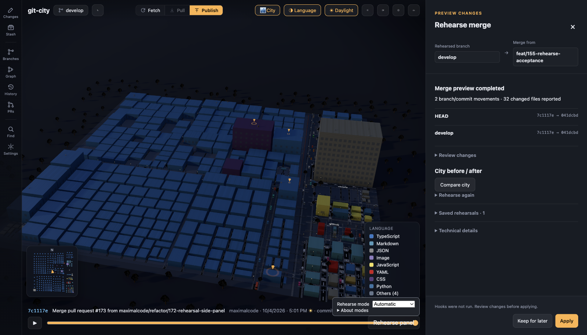

# Rehearse

Rehearse runs Merge, normal or interactive Rebase, and a single Cherry-pick in a
retained sandbox. Review the result, resolve conflicts there, then explicitly
confirm **Apply** to adopt the reviewed result in the original worktree.
A clean Git result is not proof that the resulting code is correct.

Git City v0.9.2 includes git-rehearse v1.3.0; no separate installation is needed.
Missing or damaged tools require repairing or reinstalling the app.
See [acceptance evidence](rehearsal-acceptance.md) and [development setup](rehearsal-development.md).

## The side panel

Choose **Rehearse panel**, or open a contextual Rehearse action beside a
branch or commit. Git City opens a nonmodal panel on the right side of the
workspace. The city remains visible beside it, there is no backdrop, and focus
is not trapped inside the panel. The panel shows the operation in its header,
then labels the current branch or checkout and the target or plan base. Retained
reports label the rehearsed branch or checkout, which may differ from your live checkout.

The target form is under **Choose rehearsal target** before the first run and
under **Rehearse again** after a result has been retained. A selected branch,
commit, or interactive-rebase plan is read-only when it comes from another
Git City panel. The current checkout remains unchanged while the sandbox runs.

The primary result area reports the state Git City can verify: preparing or
running, a completed preview, a no-op, conflicts, a failure, an interrupted
result, or a stale retained result. Completed reports summarize branch and
commit movements and the files reported as changed. Open **Review changes** for
the submitted plan, full ref movements, file consequences, and replay warnings.
Actionable conflict and unexpected-content warnings stay in the main report
area.

Completed reports open a content-first **Frozen file review** workspace with the
complete tracked-worktree inventory, path filtering and file selection. Results
with affected references also expose separate committed-reference scopes;
matching `HEAD` and current-branch aliases are grouped, while created and deleted
references retain an explicit empty side. Replay changed, dropped, added, and
uncompared warnings stay attached to their reference. The **Changes**, **Before**,
and **After** views read retained Git objects from the rehearsal sandbox, so edits
made later in the live checkout or sandbox cannot replace the result being
inspected. Added and deleted sides are labelled as absent; binary, mode-only,
executable-bit, symlink, gitlink, renamed, oversized, and unavailable content stays
visible with an explanation. Rename detection is bounded for very large
changesets and leaves complete add/delete entries when it cannot safely pair
paths. Endpoint blobs are limited to 2 MiB and generated patches to 4 MiB;
over-limit content remains identifiable without being presented as a complete
diff. The retained raw inventory is capped at 32 MiB; a larger inventory is
reported as unavailable rather than silently truncated. Untracked files and the
original staging selection are excluded from the tracked-worktree scope.

The file list and content pane can be resized with the divider. Focus the divider
and use the left/right arrow keys for keyboard resizing. The workspace keeps long
paths and code inside its own scroll areas at laptop and larger desktop sizes.
Use **Show city context** when spatial context helps; **Compare city** opens the
shared frozen Before/After scene, while the live city remains a separate workspace.

**Compare city** opens the frozen **Before** and **After** views when a finished
result has an available After. They use the same layout and provide a text
inventory of files and line counts. Stopped, incomplete, failed, and unresolved
results explain when an After view is unavailable. While the comparison is
open, the live scene is paused so the comparison is the only active 3D scene in
the main workspace. **Return to live city** leaves the comparison.

## Choose a mode

The **Rehearse mode** setting is shared by all linked worktrees of a repository.
New repositories use **Automatic**. For repositories already in Git City's recent
list, choose a mode once; Escape postpones the choice and blocks supported actions
until you choose. Repositories previously removed from that list cannot be
recognized as existing repositories.

- **Automatic** sends Merge, Rebase, interactive Rebase and single Cherry-pick
  actions directly into a rehearsal. Apply still requires confirmation.
- **Ask** keeps direct actions and offers explicit **Rehearse** entries beside
  them. Choosing a manual entry opens its preview form.
- **Off** uses direct Git actions. Retained work and required recovery remain
  accessible; changing mode never deletes sandboxes or bypasses a recovery lock.

Pull (including pull with rebase), Fetch and Push are outside this routing.
A failed rehearsal never silently retries the original action directly. Repair
the tool or consciously choose Off if direct execution is appropriate.

## Review and resolve

Use **Rehearse** for a merge target, **Rehearse rebase** in Branches, or
**Rehearse cherry-pick** on a selected commit in Graph or commit details.
The interactive rebase editor supports its existing Pick, Squash, Drop and
up/down controls. Review the submitted plan, including every repeated conflict
stop, before Apply.

The report identifies the worktree, exact rehearsal, action, refs, commits,
affected files, conflicts, unexpected content changes and carried tracked work.
**Compare city** switches the same scene between the frozen **Before** and
**After** states. The text inventory lists files and line counts. Incomplete
results do not have a finished After. Comparing does not switch the real checkout.
The frozen file review uses the same retained endpoint resolver as Compare city;
refreshing or changing the rehearsal invalidates older inventory and content
responses instead of showing a stale patch beside a new list.

For a text conflict, choose **Resolve**, then Ours, Theirs, Both, Edit, or
**Edit whole file**. Every section starts **Unreviewed**; the initial preview is
not a decision. Choose a version for each section, confirm an edited section,
or use a labelled bulk choice for the remaining sections. **Next unreviewed
section** moves keyboard focus to the next decision. Whole-file editing requires
**Confirm complete file resolution**, and later typing removes that confirmation.
**Inspect complete resolution** shows the assembled file before saving. These
decisions select content; they do not mean tests passed.
**Save and stage in sandbox** checks those decisions again and saves to the sandbox only.
Binary conflicts offer a complete Ours/Theirs version. During rebase, these
mean the destination and replayed commit respectively. For deletion or rename
conflicts, follow the displayed sandbox path and external staging instructions.

**Refresh sandbox** rereads external edits. Returning to the app also refreshes
the file; stale editor contents cannot silently overwrite a changed file.
Once all unmerged paths are resolved, **Continue rehearsal** runs the remaining
operation. Resolve each new conflict stop until the report is complete.
Editor choices and whole-file text are saved locally as a durable draft while you work. Draft
persistence is separate from **Save and stage in sandbox**: switching files, rehearsals or
worktrees, closing the panel, and restarting Git City restore the last acknowledged draft for the
same rehearsal identity and conflict path. A pending or failed draft save is shown in the editor;
keep the panel open and retry before abandoning it. If the sandbox changes externally, Git City
keeps the old draft, its original base, and the new sandbox revision separate. You can inspect
both, discard the draft, or deliberately use its retained text as a new draft on the current
base. That new draft requires a fresh whole-file decision. Saving and staging still checks the
sandbox revision, and a successful save clears only that exact draft. A draft left behind by
external staging remains inspectable and can be explicitly discarded before Continue.
If the sandbox file was saved but staging failed, the error says so and keeps the
editor draft; refresh the sandbox/review, or resolve the sandbox lock externally,
before staging. A write or truncate failure may have saved only part of the bytes,
so refresh before trying again. The original worktree remains unchanged.

## Apply and local work

**Apply** opens a confirmation naming the original worktree, action, checkout,
branch changes and tracked local work. Review it, then choose **Apply rehearsal**.
The backend rechecks the checkout, refs, index, local files and other worktrees.
It adopts retained commit objects rather than rerunning the original action.

The current bundle is git-rehearse v1.3.0. It does not accept an expected reviewed
result revision: a separate CLI operation can change the retained result between
review and Apply. Strict result binding is still pending
[the compatible tool release](https://github.com/maximalcode/git-rehearse/issues/119)
and [Git City's integration](https://github.com/maximalcode/git-city/issues/200).
An app-side recheck is not a substitute for that contract.

Tracked local changes are replayed in the sandbox and can themselves conflict.
After Apply, carried edits are unstaged: the original staging selection is not
restored. Untracked files are not carried work. New collisions, changed local
work, stale refs or branches checked out elsewhere cause refusal, preserving
the retained result for inspection. Create a new rehearsal against the new basis.
There is no force option. A no-op needs no Apply.

## Keep, stop and discard

**Keep for later** after completion, or **Keep and close** while running, leaves saved work intact. Closing during execution does not
stop it. **Stop rehearsal** preserves an incomplete result, which is not
automatically resumable or applicable. Apply and recovery cannot be stopped
through this control.

Retained history restores the current worktree's selection after restart.
Use **Open** to switch results and **Refresh history** to discover external
changes. Select entries and use **Discard selected**; confirmation names each
exact result. Active work and recovery data cannot be discarded. No timed cleanup
deletes retained work. Displayed logical size includes shared objects and is not
an estimate of space freed. Low available space produces a textual warning;
unknown measurements remain unknown.

## Undo and recovery

**Undo Apply** identifies the exact last Apply and its original worktree,
independently of which rehearsal is selected. Confirm **Undo this Apply** only
after reviewing that identity. Changed refs, foreign checkout occupancy or local
changes—including carried uncommitted edits—can prevent Undo. It is not a general
recovery mechanism for arbitrary file edits.

After an interrupted Apply or Undo, **Recovery required** blocks ordinary writes
across the repository's worktrees. Open the original worktree and use only the
offered **Complete interrupted apply/undo** or **Roll back interrupted apply/undo**
action. Unknown or externally changed states remain blocked. Do not delete journals
or sandboxes to remove a warning. Lost responses trigger inspection, never blind
retries. External Git tools are not locked by Git City; their changes can cause
recovery to refuse.

## Hooks, signatures and limits

The report says **Repository hooks were not run**: hooks are disabled during
rehearsal and Apply. Off keeps existing direct-action hook behavior. Existing
rerere settings and solutions are copied into the sandbox; newly learned solutions
are not written back to the original cache.

Signing settings remain effective, and signing failures do not downgrade to
unsigned commits. System signing dialogs may appear; terminal editors and prompts
are disabled. **Signature present** reports presence only. **Verification: not
checked** and **Signer trust: not checked** are separate facts. Git City stores
no signing keys.

The sandbox is not operating-system isolation: configured merge drivers and other
programs can run. Existing git-rehearse restrictions, including unsupported
submodule, LFS, shallow and empty repositories, still produce refusal.
There is no range cherry-pick, force Apply/Undo, automatic Apply, hook opt-in or
independent background tool update. App and tool versions are validated together;
incompatible retained data must be preserved, not deleted to make an update work.

## Keyboard and focus

Tab and Shift+Tab move through the panel's controls, including the target form, result
sections, saved history, conflict controls, and footer actions. Enter activates
the focused control. Escape closes the panel only when focus is inside it; it
does not stop a running preview. Focus returns to the control that opened the
panel. Apply, Discard and first-time mode selection use modal confirmation or choice
dialogs, where Escape cancels that dialog instead. Undo has an inline confirmation;
Escape cancels it and returns focus to Undo Apply.

Enter submits the preview form. Space toggles checkboxes; arrow keys change the mode selector. Rehearsal completion
focuses the textual result. File selection focuses the editor heading; refresh and
Continue return focus to the report. Compare city initially focuses Before.

Apply, Undo and Discard confirmations initially focus Cancel. Escape cancels a
confirmation or keeps and closes the panel, restoring the initiating control.
Required recovery focuses its warning. Status and warning text accompanies color.
No new global shortcut is required; see [keyboard reference](shortcuts.md).
